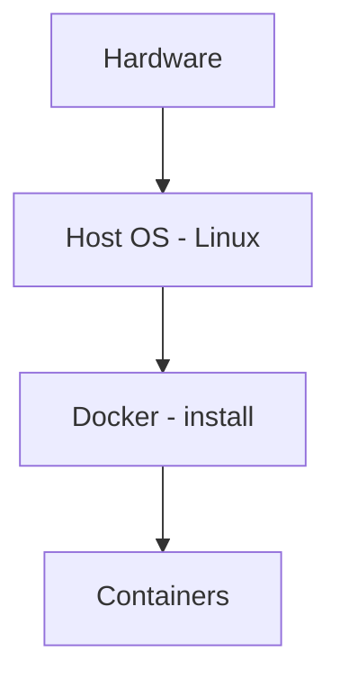
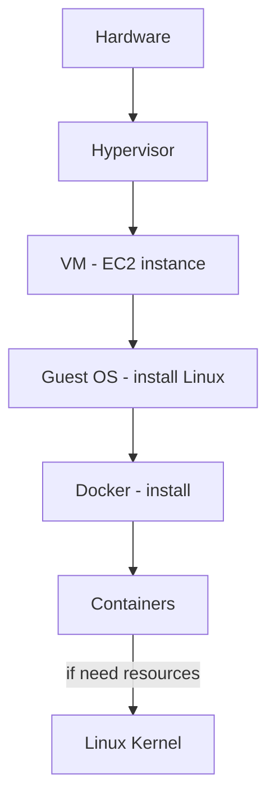

## Unit Containerization — Methods

### Method 1 — Install Docker on a Physical Server (Bare-Metal)

> **Bare-metal Container Deployment**
> Used in:
> - i) On-premises data centers
> - ii) High-performance environments

---

### Method 2 — Install Docker on VM / EC2 (Common Cloud Setup)

> **In Cloud:**
> - Containers do **not** replace VMs completely
> - AWS still uses VMs (EC2)
> - Inside VM → run containers

---

### Key Points about Containers

- i) Containers **share the same Linux kernel**
- ii) They do **not** have a separate OS

> **Containers are lightweight:**
> - Do not have a full OS
> - Use resources from Host OS

**Base Image** ⇒ System dependencies (Python, Java) + Application + Required libraries

---