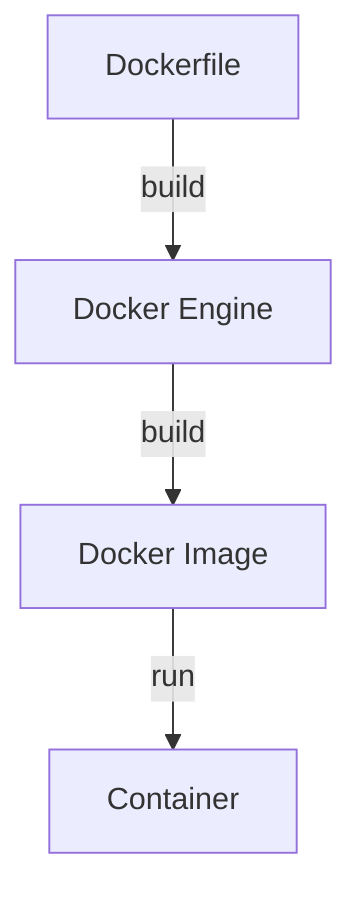

## Docker Overview

### What is Docker?

Docker is an **open-source containerization platform** that provides an easy way to containerize applications:

- i) Docker **builds** images
- ii) **Runs** images to create containers
- iii) **Pushes** containers to registries (DockerHub, quay.io)

---

## Docker Workflow

> This is the **Container Lifecycle**.

---