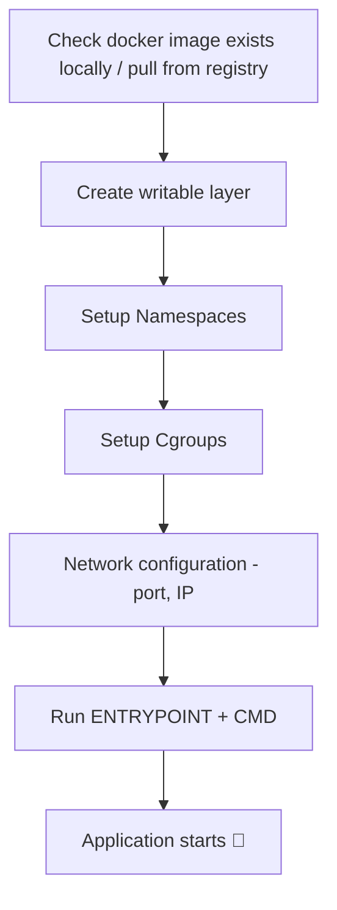

## Dockerfile

> Root directory of your project — `Python : 3.10` example

```dockerfile
FROM python:3.10                        # OS, language, version [Starting point]
WORKDIR /app                            # Creates working folder inside container [all commands run inside /app]
COPY requirements.txt .                 # Copy dependencies first
RUN pip install -r requirements.txt     # Install dependencies i.e. libraries
COPY . .                                # Copy remaining project files
EXPOSE 8000                             # Documents which port app runs on [Optional]
CMD ["python", "app.py"]                # Default command when container starts
```

---

## ENTRYPOINT vs CMD

| | ENTRYPOINT *(main execute)* | CMD |
|-|-----------------------------|-----|
| **i** | Container will always run this program | Default arguments |
| **ii** | Harder to override | Can be overridden easily |
| **Override** | `--entrypoint` flag in `docker run` | Overridden by docker run arguments |

**Example:**

```dockerfile
ENTRYPOINT ["node"]
CMD ["server.js"]
```

Result → `node server.js`

---

## Image Creation & Layers

```bash
docker build -t my-app .
#                       ↑
#              Current directory = build context
```

Docker CLI sends:
- Dockerfile
- All project files → to **daemon**

### Image Layer Structure

| Layer | Content |
|-------|---------|
|  Writable layer is added | while running |
| **Layer 5**  | Application Code |
| **Layer 4** | Installed dependencies |
| **Layer 3** | requirements.txt |
| **Layer 2** | /app directory |
| **Layer 1** *(base)* | Python 3.10 Base (Debian Linux) |

> Each layer is:
> - i) Read-only
> - ii) Has a unique hash
> - iii) Cached if unchanged

**Base image contains:**
- i) Linux filesystem
- ii) Linux system libraries
- iii) Linux package manager
- iv) Python installed on Linux

> ⚠️ **Docker uses 90% Linux-based containers:**
> - Linux namespaces
> - cgroups
> - Linux kernel features
>
> A Linux container needs a Linux kernel → OK on Linux host.
> But if host is **Windows/Mac** → Docker Desktop creates an **internal Linux VM**.

---

## Run Image

```bash
docker run -p 8000:8000 my-python-app
#                        ↑
#                     Image name
```

**Steps when running a container:**



---