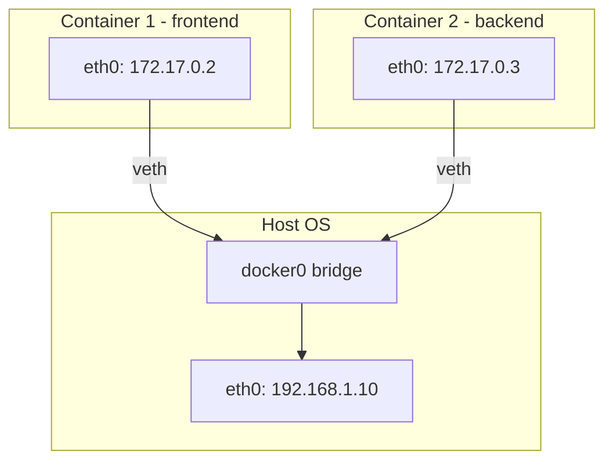
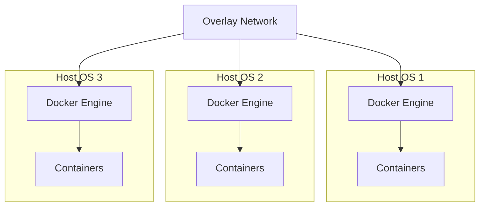
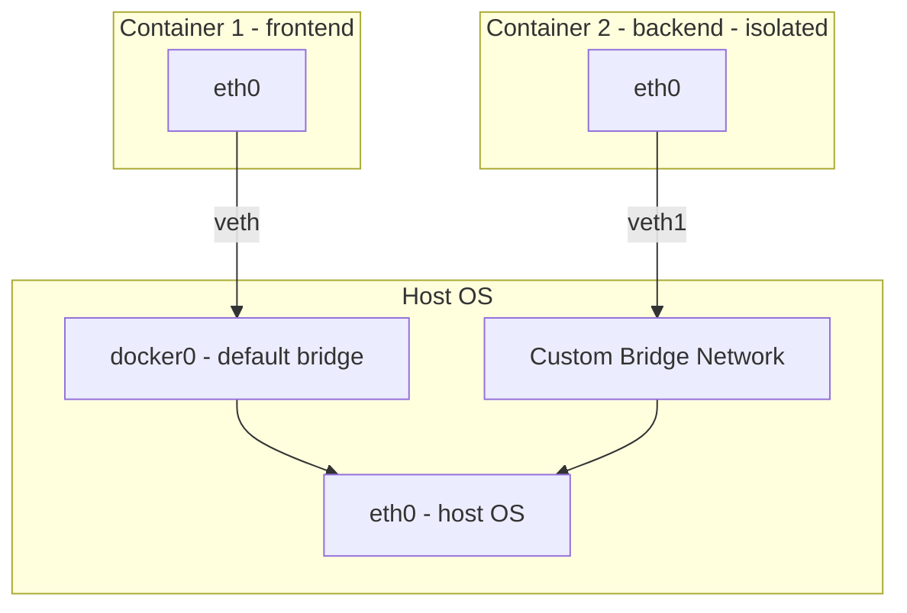
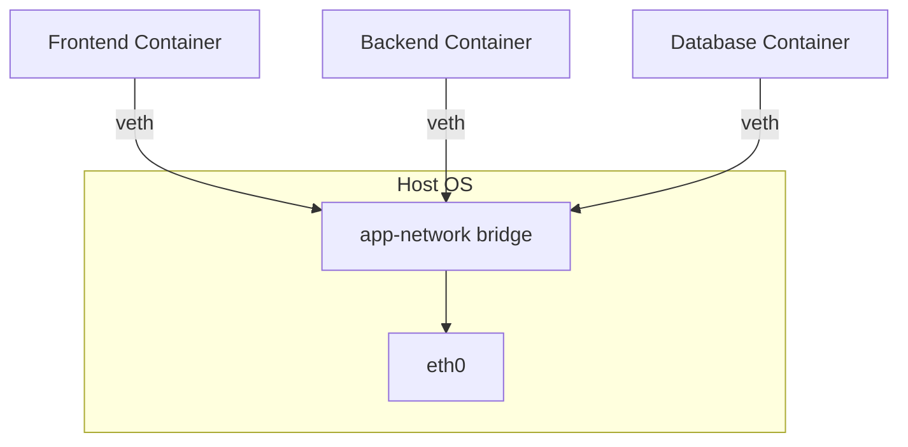

## Docker Networking

> Container Communication

### Scenarios

| Scenario | Description |
|----------|-------------|
| **Scenario 1** | One container should talk to another — e.g., frontend ↔ backend |
| **Scenario 2** | Isolation — frontend should be public, backend should be private |

---

### Bridge Networking (Default)



| | eth0 in Host OS | eth0 in Container *(virtual ethernet)* |
|-|-----------------|----------------------------------------|
| **i** | Network Interface Card (NIC) | Each container has network namespace + virtual network interface |
| **ii** | Connects machine to internet | Created by Docker, connected to Docker bridge network (docker0) |
| **iii** | Host already has its own | — |

**veth (Virtual Ethernet):**
- Each veth pair has two ends
- One end → renamed as `eth0` inside container
- Other end → stays in host & attached to `docker0`

**docker0:** Connects all container network interfaces (veth) to the host, facilitates container-to-container communication & enables external communication with host.

---

### Host Networking *(Not Secure)*

- There is **no** switch like docker0 bridge
- Containers & host OS are in the **same CIDR block**
- Whoever has access to Host OS can access the container → **Not safe**
- No separate IP for containers

```bash
docker run -d --name demo --network=host website:latest
# Container accessed via Host IP directly
```

---
### Overlay Networking *(Multi-Host Container Networking)*

An **overlay network** allows containers running on **different host machines** to communicate with each other as if they were on the **same network**.

It creates a **virtual network across multiple Docker hosts**, enabling containers in a distributed environment to interact without exposing them directly to the public network.

Overlay networks are mainly used in **container orchestration systems** such as **Docker Swarm** or similar multi-host deployments, where applications and services are spread across multiple servers but still need internal communication.



---

### Custom Bridge Network *(Isolated)*



> Default bridge & custom bridge are **completely isolated** — cannot talk to each other.

**Commands:**

```bash
# Create a custom bridge network
docker network create network_name

# Create isolated secure network
docker network create secure-network

# Run container with custom network
docker run -d --name backend --network=secure-network website:latest

# Attach another container to same network
docker run -d --name finance --network=secure-network website:latest
```

---

### Multi-Container Communication (Real-World)



> Now these containers can communicate with each other.
> Backend will ask for DB container  with IP & port no., which makes a connection.

---